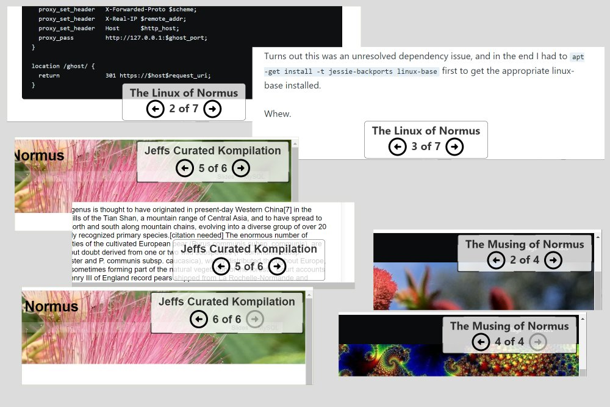

# kompl

A website navigation widget. Guide your users through a curated compilation of pages on your site.



## Installation

* Head over to [releases](https://github.com/jaguart/kompl/releases) - download the `.zip` file
* Unzip the contents into a folder that is accessible from your website - e.g. `public/`
* Add `<script src='/kompl.bundle.js'></script>` into the `<head>` on all pages on your site, **after JQuery**

## Usage

Add controls into your pages that play your compilations:

```html
  <button onclick="
    $kompl.play(
      title:'Jeffs curated Kompilation',
      slugs: [
        '/p1/',
        '/p5/',
        '/p7/',
      ],
      style: 'clean',
      size: 'large',
      place: 'bc',
      show: 80%,
    )
    ">Show me!</button>
```

## Documentation and Examples

You can see the widget in operation by clicking on the **buttons** on this page: https://normus.totahi.com/tags

You can read the documentation and examples here:
* [Anatomy of the Widget](doc/widget-anatomy.md)
* [Kompl Usage Examples](doc/example-usage.md)
* [Using the STYLE argument](doc/example-style.md)
* [Using the SHOW argument](doc/example-show.md)
* [Using the OPTIONS argument](doc/example-options.md)
* [Roadmap - planned features](doc/widget-roadmap.md)

## Credits

* Inspired by conversations with *Malcom - ZAM* - https://healthzam.com/

## Author

Jeff, aka *jaguart* on Github. https://jaguart.tech - dabbler.

This is my first playground using TypeScript in the Node-verse. Canonical https://github.com/jaguart/kompl
